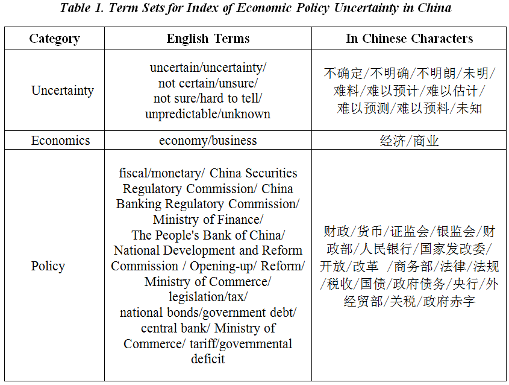
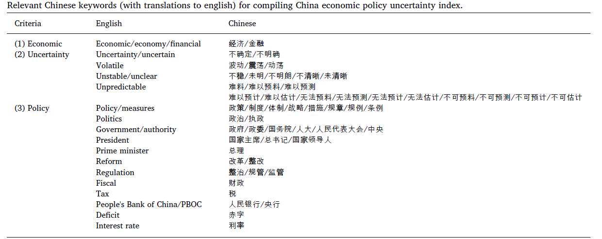

# 包: Package 'mfGARCH'

估计GARCH-MIDAS（混合DAta抽样）模型（Engle，Ghysels，Sohn，2013年，<doi：10.1162
/ REST_a_00300>）和相关的统计推断，并附有论文"Two are better than one:
volatility forecasting using multiplicative componentGARCH models"，Conrad and
Kleen（2018，<doi：10.2139 / ssrn.2752354>）。GARCH-MIDAS模型将（每日）股票收益
的条件方差分解为短期和长期成分，后者可能取决于以较低频率采样的外生协变量。

# 指标来源以及源文献阅读
## 重点文献一:中美经济政策不确定性对汇率波动率的影响[@Zhou2019]

下载地址:`http://www.policyuncertainty.com/china_epu.html`

在最近几年，EPU被普遍认为对金融市场有重要影响,例如股票市场(e.g., Liu and Zhang,
2015; Arouri et al., 2016),比特币市场(e.g., Demir et al., 2018; Gozgor et al.,
2019; Wu et al., 2019)。本文选用由Baker et al. (2016)提出的更广义的EPU，对中国汇
率的波动率进行预测。

2008年以后，各国经济政策的改变越来越频繁，引起了汇率的波动。从宏观角度看，全球化
背景下，各国经济政策的指定，修改和执行相互影响，诸如本国货币供应和利率等基本经济
变量都会影响汇率。从微观角度看，当外部经济政策的不确定性增加时，国内经济实体将改
变他们对汇率的期望，这也会引起汇率的波动。

1. 用本国EPU和美国EPU来分析对汇率的影响(January 1, 2003 to September 28, 2018)
2. 使用非参数因果分位数检验证明了各国之间的EPU差异可预测汇率。
3. 经济不确定性对股市价格波动、投资减少与就业的影响
4. 本国EPU和美国EPU做比值来表示the Sino-US EPU
   
有两个不同研究团队制定的中国经济政策不确定性的多个指标

## 指标一:BBD(SCOTT R. BAKER and ICHOLAS BLOOM and STEVEN J. DAVIS)《南华早报》
  
斯坦福大学和芝加哥大学的Scott Baker, Nick Bloom, Steven J. Davis and Xiaoxi
(Sophie) Wang根据香港地区出版的《南华早报》制定了中国经济政策不确定性指数。该指
数是月度指数，从1995年1月至今。该指数的信息来源单一，不包括大陆，不足以代表中国
经济政策[@BAKER2016]。

## 指标二:《人民日报》和《光明日报》

下载地址:`http://www.policyuncertainty.com/china_epu.html`

Steven J. Davis, Dingqian Liu and Xuguang S. Sheng根据两家中国大陆报纸：《人民日
报》和《光明日报》对与不确定性相关的概念进行了量化。制定了中国经济政策不确定性和
贸易政策不确定性的指数。他们的中国EPU总体指数是每月一次，从1949年10月至今。他们
对中国的贸易政策不确定性指数是从2000年1月至今。

  1. 第一，首先获取了至少包含三个术语集（经济学，政策和不确定性）中一个关键词的
        文章的月度计数。  
  2. 第二，用第一步得到的每月EPU原始计数/同一份报纸和月份的总文章数。
  3. 图 \@ref{fig:fig1} 使用汉字和相应的英语翻译报告了每组中的术语。
  4. 第三，他们将样本分为三个时期：中央计划时代（1949-1978），改革开放时期
     （1979-1999）和全球化时代（2000以后）。 除了其独特的经济特征外，每个时期的
     报纸惯例也有显着差异。第二阶段的每日文章计数比第一阶段高得多，而在第三阶段
     则更高。而且，讨论经济学的报纸文章所占的百分比越来越多。
  5. 第四，他们将每个报纸的按月计数的频率计数系列标准化，以实现单位标准化。他们
     使用全球化时代2000年至2018年的数据在每个阶段分别执行此标准化操作。
  6. 第五，他们按月计算报纸上标准化系列的简单平均值。最后，他们将每个时期的指标
     值归一化为平均值100。对于全球化时代，他们将2000年至2018年归一化为100。

```{r fig1,eval=T,redsults = 'hide',echo=F,fig.cap="术语说明",dev="png",results='markup', cache=F}

```
这两个团队都遵循Scott R. Baker，Nicholas Bloom和Steven J. Davis在“衡量经济政策不
确定性”中基于报纸进行文本分析的方法。

## 指标三:Huang（十家报纸）

下载地址`https://economicpolicyuncertaintyinchina.weebly.com/`

### 指数构建

在数字档案馆Wisers Information Portal中获取报纸内容并搜索相关的关键字。该平
台涵盖了114家大城市主流媒体，从中选出10家媒体，这些报纸分布在中国的主要城
市，即北京，上海，广州和天津[@Huang2020]。

从2000年1月开始通过在十家报纸的电子档案中搜索相关关键字来构建月度索引：《北京青
年报》，《广州日报》，《解放日报》，《人民日报》(海外版)，《上海早报》，《南方都
市报》，《新京报》，《今日晚报》，《文汇报》和《羊城晚报》。

对于每份报纸，我们搜索在以下三个条件中的每个条件中至少包含一个关键字的文章：
（1）经济，（2）不确定性和（3）政策。 表\@ref{fig:fig2} 显示了每个标准中的
关键字及其英语翻译。

  1. 我们用当月包含三个术语中任意一个关键词的文章数来缩放每个月的文章数。
  2. 然后对该系列进行标准化，以使2000年1月至2011年12月期间的标准差为1。 
  3. 计算十份报纸的月度系列的简单平均值。 
  4. 最后，将该指数归一化为2000年1月至2011年12月期间的平均值100。

```{r fig2,eval=T,redsults = 'hide',echo=F,fig.cap="术语说明",dev="png",results='markup', cache=F}

```

### EPU指数的特点由此产生的指数（我们称为基准指数）绘制在图1中。

该指数反映了主要的国内政策变化，包括人民币意外贬值和固定机制在2015年8月发生变
化，以及“巡回赛”未能成功启动2016年1月在中国股票市场的“破坏者”机制。它还显示出
与主要国际事件相吻合的峰值，例如2008年9月雷曼兄弟破产以及2017年1月唐纳德·特朗
普就职美国总统就职。该指数没有对政策不确定性的根源是国内还是国外有任何先验看
法。可能情况是，某些外国事件严重到足以通过贸易联系，国际资本流动和信任渠道在
中国产生影响。的确，中国确实采取了一些经济政策来应对全球性的巨大冲击（例如，
面对2008年全球金融危机，2009年采取了4万亿美元的财政计划）。但是，我们发现在
这9/11恐怖袭击事件中，中国的EPU没有任何增长（美国和全球EPU指数的上升幅度很大
（Davis，2016年））。此外，2008年之后，中国的EPU似乎出现了结构性转变。这是由
于在此期间设定的不确定性术语中关键字的使用增加了。对这一结果的一种解释是，全
球金融危机可能加剧了人们对中国经济不确定性的认识，这一点已在报纸上反映出来。

作者计算了上海（证券）综合指数的股票收益率的已实现波动率。 地缘政治风险指数由
Caldara和Iacoviello（2018）构建，其数据可从
https://www2.bc.edu/matteo-iacoviello/gpr.htm获得。 策略变更指数由Chan和Zhong
（2018）编译，摘自https://policychangeindex.com。

图2的右上图绘制了我们的指数以及上交所综合指数的已实现波动率。 这两个指数趋于
一起移动（相关系数为0.19），但股市波动率指数并未反映出诸如唐纳德·特朗普就职典
礼之类的非金融事件。

左下方和右下方的图显示了与地缘政治风险指数和政策变更指数的比较，它们都是使用
报纸上的文本挖掘技术构建的。Caldara和Iacoviello（2018）通过搜索与地缘政治紧
张局势相关的一组关键词来构建地缘政治风险指数。 Chan and Zhong（2018）使用机器
学习技术来检测政府喉舌《人民日报》如何在首页上优先考虑其政策问题。 政策变化指
数的上升表明近期内将发生重大政策变化，这与政策不确定性有关。 这些指数均与我们
的EPU指数无关。

### DAILY EPU AND uncertainty indices by policy category

使用相同的方法，我们使用所有114家报纸在样本期内生成每日EPU指数。 每日EPU指数
的月平均值与我们的基准指数0.95相关。 此外，我们为财政政策，贸易政策，汇率和资
本账户政策以及货币政策这四个政策类别构建了月度不确定性指数。 如果报纸文章满足
基本的“经济，政策和不确定性”标准，并且符合特定类别的附加术语集，则该类别会被
一个策略类别指数选中。附录A.1报告定义策略类别并显示的完整术语集索引

### ROBUSTNESS:证明EPU指数对报纸选择和媒体偏见的鲁棒性。

在本节中，我们对基准EPU指数进行稳健性检查。 我们专注于两个方面，涉及我们的报纸选
择和媒体控制可能造成的扭曲。

#### 报纸选择

为了表明我们选择的10家报纸不会扭曲不确定性的度量，我们使用Wisers Information
Portal上所有114种普通兴趣报纸重新计算了EPU指数。 有关报纸的完整列表，请参见附
录A.2。 该索引的一个缺点是报纸进入和离开档案馆，因此报纸的数量随时间变化。 尽
管如此，我们发现114报纸指数与我们的基准指数相关联为0.96，表明我们的基准指数没
有系统性的偏差。

作为进一步检查，我们从这114家报纸中随机抽取10家报纸，并构建了EPU指数。我们重
复此练习10,000次。 图3显示了这些指数的第10个百分点和第90个百分点，以及我们的
基准指数和114种报纸指数。 基准指数（红线）大多数时候都位于两个波段之间，这再
次表明我们报纸对基准指数的选择是合理的。

#### 媒体控制

接下来，我们调查中国的媒体控制是否会影响我们的指数。实际上，中国大陆所有普通
报纸都由中国共产党委员会（CCPC）拥有和监督。但是，应该指出的是，即使在美国这
样的民主国家，报纸也根据其政治立场表现出媒体偏见，这有可能影响其报道
（Gentzkow和Shapiro，2010）。对于中国指数，我们主要关注的是政府审查制度是否系
统性地偏向所有报纸，以至于扭曲了该指数传达的信息。根据文献（Brady，2009年；
Roberts，2018年； Stockmann，2013年），当局可以通过多种方式指导有关新闻报道的
决策。禁止报道政治上最敏感的话题。此外，有些话题允许媒体报道，但要遵循官方准
则。准则通常采用以下三种形式之一。首先，可能会指示报纸转载来自中国官方国营新
闻机构新华社的新闻。例如，罗伯茨（Roberts，2018年）在2012年从25个省级和市级报
纸中收集了报纸文章。她发现，大约有50种情况下，文章在70％以上的报纸中得到协
调，并且这种协调是在敏感的政治会议期间发生的。其次，有时会指示报纸通过将其
放在报纸的后页而不是首页上来淡化报道。但是，这种形式的审查不会影响我们的EPU指
数。第三，有时会指示报纸“关注积极宣传”，例如关注政府机构为应对自然灾害而进
行的救援活动，而不是人员伤亡。例如，Roberts，Stewart和Airoldi（2016年）发现，
新华社报道的与中国治理相关的话题相对于AF和AFP等西方新闻社而言更为积极。

我们提供了与媒体偏好相关的三组检查。第一组检查涉及横截面偏差，这意味着在整个
采样期间，某些报纸可能会比其他报纸受到更多的控制。 Qin，Strömberg和Wu（2018）
提供了一些证据，表明媒体根据中国报纸市场竞争的偏见程度来区分其产品。为此，我
们利用了Qin等人构建的媒体偏差指数。他们针对与媒体偏见相关的九个内
容领域的每个报纸关键词进行计数，并使用主成分分析来提取媒体偏见的度量。该指数
适用于我们样本中的所有114家报纸。我们将这114篇论文依据中位数分为两组，并使用
与基准指数相同的关键字和汇总方法为每组构成一个指数。表2报告了指数的相关性。例
如，我们的基准指数和使用偏重较大的报纸计算得出的EPU指数的相关性分别为0.93和
0.94。高度相似性表明，媒体偏向对我们的EPU指数没有定性影响。或者，我们根据
（1）所有权类型分割报纸； （2）监事会的级别，并为每个类别构建EPU指标。同样，
这些因素对基准EPU指数没有定性影响。分析的详细信息在附录A.3中提供。
   
第二组检查涉及随时间变化的偏差程度。例如，习近平主席于2013年上任后，媒体审查
制度可能会发生变化。由于我们的EPU指数具有时序性，当人们在统计分析中使用EPU指
数时，时变的媒体偏见可能会影响统计推断。我们进行三项检查。首先，为了解决协调
问题，我们使用新华社提供的内容检查指数是否受到中国报纸的影响。我们构建的指数
将忽略所有内容中包含“新华社”字样的文章。所得的指数再次与基准指数密切相关，
达到98％。其次，我们会查看10家报纸中随着时间推移其新闻中带有“新华社”字样的新
闻份额。图4显示，在我们的样本期内，该份额没有任何可观察到的趋势或结构性中断。
第三次检查询问报纸文章在经济新闻中多久提及关键政府部门。具体来说，我们用10家
报纸计算出所有经济新闻（符合条件的新闻文章）中使用关键词“共产党政治局”，“国务
院”或“中央政府”的文章所占的比例（表1）.图5报告了此份额随时间的变化。同
样，我们在样本期内没有看到任何明显的趋势。13这表明，尽管中国媒体总体偏见程度
可能随时间变化，但这种偏见似乎并未对经济新闻的方式产生明显影响。

最后，为了解决“关注积极宣传”的问题，我们比较了中国大陆媒体和香港媒体报道的新闻情
绪。 请注意，香港的媒体不受官方媒体审查。 因此，如果中国当局审查在中国大陆传达负
面情绪而新闻却未经审查的香港媒体，则我们希望在香港新闻中看到更多负面情绪。

为了进行情绪分析，我们选择了香港的10种中文报纸与我们的10种大陆报纸进行比较，进行
情感分析。图6绘制了10种中国大陆报纸（以蓝色显示）和10种香港报纸（以红色显示）的
情感价值分布。还报告了相应的第一时刻和第二时刻。选定的事件包括中国加入世界贸易组
织（WTO），股份制改革，次级抵押贷款危机，欧洲债务危机，人民币汇率改革以及断路器
机制启动失败。一般而言，内地报纸所产生的情绪分布与香港报纸所产生的情绪分布相似，
均值和标准差相近。也许唯一的例外是2016年中国股票市场推出了断路器机制（右下图）中
国大陆的文章更倾向于积极情绪，中国大陆文章的均值（0.28）略高于香港文章的均值
（0.22）。在其他时段，我们没有发现与经济政策不确定性相关的新闻受到严格的系统审
查。


**总结:**几种指数的区别主要在于所选报纸(信息来源)不同

# 参考文献
[//]: # (\bibliography{Bibfile})