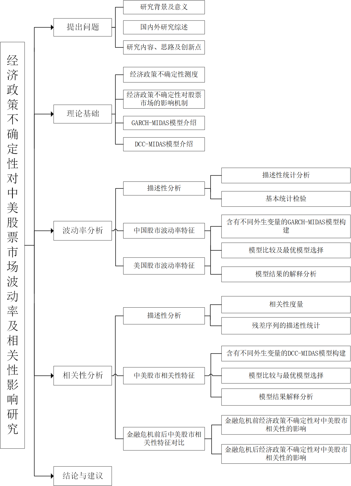
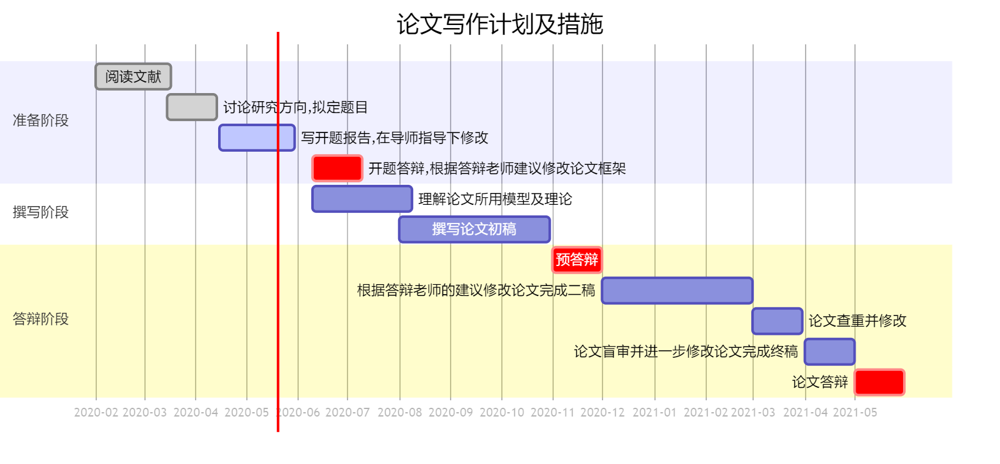

```{r setup, echo=F, purl=F}
knitr::opts_knit$set(root.dir = getwd())
knitr::opts_chunk$set(echo = TRUE, results = 'hide')
knitr::opts_chunk$set(warning = FALSE, message=FALSE)
knitr::opts_chunk$set(fig.align="center"
                      ## ,out.width="0.9\\textwidth" # latex
                      ,out.width="60%" # for both latex and html
                      ,fig.width=5, fig.height=3
                      )
```

```{r prepare, echo=F, purl=F}
rm(list=ls())
options(digits=4)
options(scipen=100)
graphics.off()
Sys.setlocale("LC_ALL", "Chinese")
```

# 选题意义与研究综述

## 研究背景

当今世界形势错综复杂、充满矛盾，大国博弈持续加剧，国际秩序正经历新旧交替的转型过
渡期。美国国家安全战略视大国竞争为首要关切，执意以"美国优先"原则重塑世界秩序，导
致大国博弈加剧，尤其是中美之间的较量博弈。随着中美实力对比的消长，美国对中国的防
范和打压力度逐步增强。中美博弈艰巨复杂。但同时，美国是中国最大的贸易伙伴国和境外
投资主要来源地，中国是美国的最大进出口贸易国，并且我国对美投资一直呈增长态势直至
特朗普上台执政前。总的来看，两国在经济、贸易和金融领域的关系既有较量，又有合作，
但随着中美贸易争端不断升级，二者关系越来越复杂。(中美关系复杂)

除此之外，欧盟一体化艰难前行，欧洲政治生态内部发生巨大变化，内部矛盾叠加，英国脱
欧也给欧美带来多重震荡。在美国持续破坏多边国际秩序的情况下，欧美保护主义、排外主
义与自顾情绪高涨，不稳定性上升，对全球经济健康发展造成严峻挑战。在此背景下，中国
不断深化改革，优化经济结构，转换增长动力，为应对不断演变的世界变局和为国内经济发
展提供动力。相应地，我国出台一系列举措，但这增加了经济政策的不确定性。如2007年，
实体经济增长过热，央行连续多次加息，避免积累过大的泡沫。当前全球受疫情影响，世界
经济衰退的风险加剧，我国对此采取多项举措。如设立3000亿元低成本的专项再贷款，降准
释放5500亿元资金支持实体经济，以及加大金融监管等一系列降息、降准、降费等维护市场
稳定的系列政策措施。

所有的经济政策都是为应对经济局势的不断变化，保证经济平稳发展，但这也导致了经济政
策不确定性的上升。为更好的发挥经济政策的调控作用，有必要定量研究经济政策不确定
性，以更好的把握调控力度。在2008年至当前世界经济的背景下，政府、学界对经济政
策不确定性的研究热度一直不减，特别是在Baker等在2013年编制了以美国经济政策不确定
性研究为主的世界经济政策不确定性指数后，越来越多的学者和政策研究机构(例如著名的
FRED数据库)开始使用这一系列指数研究政策不确定性的宏观经济效应以及其对金融市场等
的影响。

由于股市作为宏观经济运行的"晴雨表"，一直是经济调控重点。而我国股市早期受政策影响
较大，且国企比例占据股市多数份额，散户、个人投资者居多，为此，针对股市改革的步伐
也在不断推进。如今，我国股票市场初具规模，作为重要的资金流通市场，对我国经济发展
有重大作用，但与发达国家相比，监管力度、市场环境等方面仍需改善。中国试图深化、发
展和强化金融市场,同时,放松对跨境资本流动和外资参与境内金融市场的限制，使国内市场
更具流动性和稳定性，营造良性的竞争环境,增加国内金融机构的竞争力。但在现实中，政
策效果不尽如人意。金融市场的波动会导致大量资金外流，资金外流又进一步加剧国内金融
市场波动（例如,2015 年发生的股市异常波动），为政策制定者带来挑战。在此背景下，国
内涌现出关于经济政策不确定性对于股票等金融市场影响的研究。本文拟在对已有文献归纳
总结的基础上，继续深化这一研究，探究经济政策不确定下对股票市场的影响。

## 选题意义

当前，世界经济发展呈现出逆全球化等不利因素，国与国之间的外交关系瞬息万变，加深了
经济发展的不确定性。同时，随着我国特色社会主义市场经济的不断推进，很多政策的制定
和实施都在探索中前进，不可避免的出现意料之外的情况。经济政策往往会存在时滞性和效
果不尽如人意的地方，为此，政府需要不断地适应新的变化条件，进行较为频繁的预调和微
调，经济政策不确定性势必增加，对于对经济政策变动较为敏感的资本市场，这必然会造成
相应的影响。我国股票市场作为一个新兴的市场，虽然起步晚，但是经过了十多年的快速发
展，目前已经初具规模，在中国的经济发展中发挥着重要作用，而且我国对金融市场的改革
仍在不断推进。因此，准确测度各种经济政策的出台实施对股票市场的影响无论是在理论研
究还是实际应用方面都具有重要意义。

首先是理论意义。由于经济政策不确定性和金融数据属于不同频率，学者们在研究经济政策
不确定性与金融市场的关系时，主要采取两种办法进行处理。一种是将高频数据通过平均的
方法转换为低频数据，但这种方法损失了金融数据中蕴含的大量信息。另外一种方法则不改
变数据频率，以近年来备受国内外学者青睐的混频数据采样模型（MIDAS）为主，但在金融
市场的应用中，对数据本身呈现出的高峰厚尾特性又欠考虑，因此，本文拟采用t分布下的
广义自回归条件异方差混频数据抽样模型(GARCH-MIDAS)来探究经济政策不确定性对股票市
场的影响，从而弥补这一不足，丰富相关的研究内容。

其次是现实意义。从政策制定者的角度来讲，探究经济政策不确定性对股票市场的影响，可
以为其提供参考意义。从广大市场参与者的角度来讲，股票市场关系着广大投资者和企业的
切身利益。通过调整经济政策，国家实现对股票等金融市场的调控，使之结构更加合理，制
度更加完善，资源得到合理分配，从而为实现资金有序流动，促进经济健康发展服务。投资
者通过对经济政策不确定性对股票市场影响的合理预期和科学认识，合理安排自身投资计
划，从而实现自身利益。但本文通过总结国内外文献中关于经济政策不确定性对股票市场的
影响研究，发现，所采用的中国经济政策不确定性测度具有片面性，而且忽略了金融数据的
波动聚集性，因此，所得到的结论需进一步核实。本文拟针对现有文献的不足，对经济政策
不确定性关于股票市场的影响进行重新测度，不仅丰富了这一研究主题，而且通过与现有文
献结论的结论比较，得出科学合理的论断，从而为宏观经济政策的制定和实施提供具有建设
性的参考，同时也为广大投资者作出合理预期提供方向。

## 国内外研究现状述评

### 经济政策不确定性的文献回顾

经济政策不确定性衡量了经济政策与公众预期之间的偏离程度，为了准确测度这种不确定
性，Baker(2016)编制了22个国家(地区)的经济政策不确定指数(EPU)[@Baker2016]，之后，
Huang等(2020)构造了中国不同类型的经济政策不确定性指数[@Huang2020]。但Baker的经济
政策不确定性提出较早，故该指数受到国内外众学者的关注，并得到了很多领域的认可和应
用。研究范围主要包括经济政策不确定性对对外贸易、就业、宏观经济以及企业行为的影响。

第一、经济政策不确定性在外对贸易、就业率领域的应用，但并非均造成不利影响。如
Canh(2020)利用线性面板数据模型，对2003-2013年间21个经济体的国内经济政策不确定性
和外国直接投资(FDI)进行研究，研究表明:国内经济政策不确定性的增长会对FDI造成不利
影响，但全球经济政策不确定性可能会增加流入该国的外国直接投资[@Canh2020]。杨旭和
刘祎(2020)基于中国EPU,使用动态面板模型与面板平滑转移（PSTR）模型，探讨经济政策不
确定性对进口贸易的影响。结果表明：总体上，经济政策不确定性的上升抑制了进口总额的
增加，但推动了进口质量的相对提升[@杨旭2020]。单东方(2020)通过VAR模型,分析经济政
策不确定性对FDI的影响，结果表明：经济政策不确定性的增大,会导致FDI流入的减少;同
时，国内东中西部，经济政策不确定性对FDI的抑制作用呈现强度和时间显著增大的态势[@单东方2020]。
Caggiano(2017)研究美国经济衰退期间和扩张期间经济政策不确定性意外增长对失业率的影
响。研究发现，无论是经济衰退期还是扩张期，经济政策不确定性均会引起失业率增加，但
衰退期，经济政策不确定对失业率的影响更大[@Caggiano2017]。谢廷宇(2020)在分析经济
政策不确定性对就业率的影响时,发现:经济政策不确定性对不同国家的就业率均存在显著负
效应, 并且越是经济发展水平和法治水平低的国家,经济政策不确定性对国家就业率的抑制
作用就越大[@谢廷宇2020]。

第二、大部分学者认为经济政策不确定性对宏观经济的影响是负向的。孙永强等人(2018)采
用MVEGARCH模型，研究了经济政策不确定性对经济波动的动态影响。研究发现经济政策不确
定性并不一定会引起经济波动[@孙永强2018]。金春雨和张德园(2020)研究了中国财政政
策、货币政策、贸易政策以及汇率与资本项目政策四种类型的经济政策不确定性对宏观经济
的影响。结果显示:四种经济政策不确定性均会导致产出下降,汇率与资本项目政策不确定性
对产出的影响最大,财政政策不确定性影响最小[@金春雨2020]。黄宁和郭平(2015)，刘镜秀
和门明(2015)的研究均显示政策不确定性对我国的经济增长有短期的不利影响[@黄宁2015;@刘镜秀2015]。
许志伟和王文甫(2019)运用结构向量自回归方法，得出中国经济结构的变化会加大经济政策
不确定性对宏观经济的不利影响[@许志伟2019]。

第三、经济政策不确定性在企业行为等微观经济领域的应用，并得到一致结论:经济政策不
确定性会对企业融资、投资等企业行为造成不利影响。如宋云星（2020）认为,经济政策不
确定性的加剧对我国民营企业融资效率的提升有显著的抑制作用[@宋云星2020]。张光利
(2018)发现经济政策不确定会显著降低企业的融资约束水平[@张光利2018]。韩亮亮(2019)
研究发现:经济政策不确定性的提高会抑制国家或地区的创新产出[@韩亮亮2019]。韩国高
(2014)，李凤羽和杨墨竹(2015)的研究结果均显示:经济政策不确定性对企业投资有抑制作
用[@韩国高2014;@李凤羽2015]。

综合以上研究可以发现，经济政策不确定性对宏微观经济主要是不利影响。并且这种影响在
宏观经济中还具有区域或周期的不对称性。而股票市场作为反应宏观经济的"晴雨表"，直接
研究经济政策不确定性对股票市场等金融市场的影响也有重要意义。因此，接下来重点关注股票市
场和经济政策不确定性对股票市场的影响。

### 关于中美股票市场波动率及相关性研究的文献综述

#### 关于经济政策不确定性对中美股票市场波动率影响的文献综述

在Baker发布经济政策不确定性指数以后，国内外对于经济政策不确定性与股市关系的研究
也多了起来。接下来分别介绍经济政策不确定性对中美两国股市波动率的影响。

关于经济政策不确定性对美国股市波动率的影响，学者们即关注整个股市，也关注对不同行业股票
波动率的影响。如Antonakakis等人(2013)的研究表明政策不确定性与股市已实现波动率之间存在时变相关
性，这种相关性在美国经济衰退期表现更强烈[@Antonakakis2013a]。Liu(2015)研究美国经
济政策不确定性对美国股票市场波动的可预测性时，发现较高的经济政策不确定性会导致市
场波动显著增加[@Liu2015]。Wang(2020)通过改变GARCH-MIDAS模型中短期成分和长期成分
的模型设定，对美国标准普尔指数的波动性进行预测,结果显示GARCH-MIDAS模型中短期波动
性成分的不对称性和极端波动性效应的引入明显提高了预测能力[@Wang2020]。Yu(2018)在
进行美国行业级股票市场波动率研究时，发现美国经济政策不确定性对不同行业股票的波动
率影响有差异，全球经济政策不确定性亦是如此[@Yu2018a;@Yu2018b]。

关于经济政策不确定性对中国股市波动率的影响，国内的研究内容也同样丰富。如陈进国
(2014)以上证综指为代表，通过DCC-MGARCH模型和VARMA-BEKK-MGARCH模型研究中国股票市
场，发现股票市场与政策不确定性之间具有显著的相关性和很强的时变性[@陈国进2014]。
王永莲(2017)利用GARCH-MIDAS模型，研究发现我国经济政策不确定性对股票市场(沪深300
指数)波动的影响相对较弱,经济政策不确定性的上升会在一定程度上会加大我国股票市场的
波动[@王永莲2017]。雷立坤(2018)在运用GARCH-MIDAS模型分析经济政策不确定性(EPU)对
上证综指波动率的影响时，得出：EPU指数能够很好地解释我国股市波动的长期成分,并显著
改善对上证综指波动率的预测精度[@雷立坤2018]。夏婷和闻岳春(2019)同样使用
GARCH-MIDAS模型进行研究，但结果表明:中国经济政策不确定性指数对A股的波动率无显著
影响，但会影响B股的长期波动率[@夏婷2018]。石强等(2019)利用GARCH-MIDAS模型得出，
经济政策不确定性对股市波动(上证综合指数)的影响呈现出阶段差异性[@石强2019a]。

综合以上可以发现，虽然大多数学者的研究表明经济政策不确定性对股市波动率有显著影
响，但各结论还是存在差异。同时，相比国外学者，国内的研究关于经济政策不确定性对不
同行业股票波动率的影响关注度还不够，但这不是本文重点，本文将继续关注经济政策不确
定性对股市波动率的影响以及呈现出的阶段性特征。

#### 关于中美股票市场间相关性研究的文献综述

自中国金融市场开始改革以来，中国股票市场与世界股票市场的联系日益紧密，尤其是发达国家。
目前，已有很多文献关注中美股市的相关性，并研究其背后的影响因素。故接下来对这部分
文献作简要回顾。

第一、中美股票市场间相关性研究

随着中国对外开放的不断推进，中美股市关联性呈现出逐渐增强的特征，并且广大学者们关
注QDII制度、金融危机和贸易战等重大事件对中美股市关联性造成的阶段性影响。如较早时
期，韩非和肖辉(2005)以2000年1月1日到2004年12月31日间的美国标准普尔指数和上证A指
为对象，研究中美股市的相关性，结果发现：中美股市的相关性很弱[@韩非2005]。之后，
胡秋灵和刘伟(2009)基于2007年8月1日到2008年12月31日的日数据,利用VAR模型研究中美股
市的联动性，得出：二者之间具有一定的联动性[@胡秋灵2009]。张兵，范致镇和李心丹
(2010)以2001年12月12日到2009年1月23日上证指数与道琼斯指数的日交易数据为样本,分阶
段检验了中美股市的联动特征。主要结论是：中美股市之间不存在长期均衡关系；但在QDII
实施之后,美国股市对中国股市的波动溢出呈现不断增强之势[@张兵2010]。潘文荣和刘纪显
(2010)利用相关分析和单位根、协整、格兰杰因果检验、误差修正模型等方法对中美股市在
QFII及QDII制度实施后的联动性进行研究,研究结果表明,中国股市与美国股市之间的联动性
正在逐步加强[@潘文荣2010]。李红权，洪永淼和汪寿阳(2011)利用2005年7月26日至2009年
7月7日间的中美股市数据，研究发现：在次贷危机后美股与A股的相关关系显著提升[@李红权2011]。
国外学者Kenourgios,Samitas和Paltalidis(2011);Aloui,Aïssa和Nguyen(2011);Singh和
Kaur也证实了金融危机期间，中美股市的关联性[@Kenourgios2011;@Aloui2011;@Singh2014]。
饶建萍，王波和唐铭惠(2019)利用2017年1月3日到2019年6月7日间的数据，通过ECM模型研
究贸易战前后中美两国股市的联动性。研究发现:贸易战前后,我国股票市场都受到美国股票
市场的影响,而反过来,中国股票市场的走向几乎不会对美国股市造成影响;贸易战之后，两
国股市的联动性降低[@饶建萍2019]。

第二、中美股票市场间相关性影响因素研究。

除了关注中美股市相关性本身的特征之外，也有学者探究造成这种关联性逐渐增强的原因。
如游家兴和郑挺国(2009)运用DCC-GARCH模型研究从1991年到2008年中国与美国等股票市场
联动的时变轨迹及其特征,研究发现中美股票市场联动性虽有增强的趋势,但处于较低的水
平，并将中美股市关联性的增强归因于中国股市的不断开放[@游家兴2009]。杨雪莱和张宏
志(2012)通过在(DCC)GARCH模型中引入宏观经济变量，得出,美国货币政策冲击的结构性突变是
中美股市联动的最重要原因[@杨雪莱2012]。刘阳和高惠(2012)采用DCC-GARCH方法量化中美股
票市场的长期联动关系。研究发现，中美两国间双边贸易依存度、金融开放度、经济周期差
异度、汇率形成机制以及外部冲击都对两国股市联动关系产生影响[@刘阳2012]。张金萍和
王准(2014)以1998年1月1日至2011年12月30日中国上证指数收益率和美国道琼斯指数收益率
为数据样本,建立DCC-GARCH模型。研究发现，中美股市相关性经历了由负为正的过程。并且
中国加入WTO、引入QFII和QDII、中国股权分置改革、全球金融危机和美债危机都对中美股
市联动性产生了一定影响[@张金萍2014]。龚金国和史代敏(2015)以2005年7月26日至2009年7
月7日间的上证综指和美国标准普尔指数为研究对象研究中美股市联动。得出，中国金融自
由化不是中美股市联动的原因，反而，贸易强度的变化是联动增强的主要原因[@龚金国2015]。
Chiang和Chen(2016)的研究发现，中美股票市场之间的收益率相关性是随时间变化
的，显示出的结构性变化是由中国采用金融自由化和发生全球性金融危机而引发的[@Chiang2016]。

综合以上，可以得出：随着两国经济往来的不断推进，中美股市的相关性有逐步增强的趋
势。并且金融危机、美国货币政策冲击的结构性突变以及中国自身在金融市场的逐步改革和
开放是促使两个市场关联性逐步增强的原因。这也从侧面反映出美股对中国股市的影响更为强
烈。

### 混频数据模型相关文献综述

从之前的文献综述部分可以看出，对于股市波动率的研究方法，已有学者使用GARCH-MIDAS
模型，而对于股市相关性的研究方法，虽有DCC-GARCH、VAR等模型可供选择，但在具体计算
时，必须保证所使用数据是同频的。本文拟采用基于混频数据的GARACH-MIDAS模型和
DCC-MIDAS模型探究经济政策不确定性对股市波动率及相关性的影响，所用数据分别是月度
数据和日度数据，无需进行同频处理。故接下来着重介绍有关这两种模型的国内外文献。

#### GARCH-MIDAS模型的提出及应用

GARCH-MIDAS模型于2013年首次被提出。Engle等
(2013)受到混频数据采样（MIDAS）回归模型可以以更高采样频率的时间序列数据作为自变
量的启发，提出广义自回归条件异方差混频数据抽样模型(GARCH-MIDAS),研究股市波动与宏
观经济活动之间的关系[@Ghysels2002;@Engle2013]。他们使用MIDAS方法将宏观经济变量与
长期波动率联系起来，同时使用GARCH过程描述每日股票市场的短期波动率，所以叫做
GARCH-MIDAS模型。该模型显示出良好的预测能力。由于通常的混频数据都要预先处理，先
转换为同频数据再进行下一步研究，GARCH-MIDAS模型，解决了在模型中同时使用不同频率
数据的难题，故在宏观经济学和金融学中具有广泛的适用性。

国内外学者对于GARCH-MIDAS模型的应用广泛分布于股票市场、黄金市场、原油市场、债券
市场等领域。如Asgharian(2013)利用GARCH-MIDAS模型研究意外通货膨胀，失业率等宏观经
济变量对美国股市波动率的影响[@Asgharian2013]。Wei(2017)利用GARCH-MIDAS模型探究经
济政策不确定性指数、石油需求量，供应量等众多影响石油价格的因素中，最重要的因子[@Wei2017]。
Pan等(2017)利用区制转换GARCH-MIDAS研究长期宏观经济因素和短期结构性突破对石油波动性的
影响,实证结果显示考虑结构性突变的GARCH-MIDAS模型具有良好的预测效果[@Pan2017]。
Fang(2018)利用引入全球经济政策不确定性指数的GARCH-MIDAS模型，研究黄金市场的波动
率并做出预测，GARCH-MIDAS模型的预测性能明显优于GARCH(1,1)模型[@Fang2018]。李佳
(2019)应用GARCH-MIDAS模型研究中国宏观经济景气指数对沪铜期货长短期波动的影响，张
屹山(2018)利用GARCH-MIDAS模型研究宏观经济波动对银行间债券市场和利率互换市场波动
的影响。研究结果都显示:宏观经济等外部系统性风险对股票市场、商品期货市场、银行间
债券市场和利率互换市场的波动率有显著影响，并且宏观经济的不确定性会加剧这些市场的
波动[@李佳2019;@张屹山2018]。石强(2019)以上证综指和通货膨胀率等宏观经济变量为研究对
象，构建GARCH-MIDAS模型来研究宏观经济与股市波动关系，指出:GARCH-MIDAS模型较好地
描述了宏观经济与股市波动之间的关系[@石强2019]。Zhou等(2019)利用引入中美EPU比率的
GARCH-MIDAS模型来研究中美经济政策不确定性对汇率波动的影响,并得出:GARCH-MIDAS模型
的样本外波动率预测性能比优于传统GARCH类模型[@Zhou2019]。

#### DCC-MIDAS模型的提出和应用

Colacito,Enger和Ghysels受GARCH-MIDAS模型的启发，
将Engle(2002)提出的动态条件相关性模型(Dynamic Conditional Correlation Model，下
面简称DCC模型)与GARCH-MIDAS模型结合起来，于2011年首次提出混频数据抽样动态相关系
数模型(DCC-MIDAS)[@Engle2002;@Colacito2011]。他们将动态相关系数也分为长期相关成
分和短期相关成分。短期相关成分可以由DCC结构中类似GARCH(1,1)的动态过程描述，而资
产之间的长期动态相关性由MIDAS模型对滞后的已实现相关系数加权获得。但Colacito等人
的长期相关成分并未与宏观经济变量相关联，不能像GARCH-MIDAS的长期波动一样，直接将
宏观经济变量作为长期动态相关系数的解释变量。基于此，Conrad,Loch和Rittler(2014)提
出拓展的DCC-MIDAS模型，研究宏观经济变量对美国石油和股票市场相关性的影响[@Conrad2014]。

之后，DCC-MIDAS模型在金融领域有了更加广泛的应用。如Turhan等人(2014)利用DCC-MIDAS
模型原油与主要资产类别之间的时变长期相关性，发现：在2008年全球金融危机之后，原油
库存与债券市场之间的正相关性逐渐提高[@Turhan2014]。Asgharian(2016)使用同时含有已
实现相关系数和宏观金融变量的DCC-MIDAS研究通货膨胀、利率等因素对美国股债两市相关
性的影响，结果表明，在经济疲软时期，二者的相关性很小且为负[@Asgharian2016]。
Fang,Yu,and Li（2017)利用修改的DCC-MIDAS模型,综合考虑结构性变化，引入虚拟变量研
究经济政策不确定性对美国股债两市相关性的影响，结果发现经济政策不确定性对二者的相
关性具有显著的负向作用[@Fang2017]。同时，Fang等人(2018)在对原油和美国股市相关性
的研究中，发现经济政策不确定性对原油股票的相关性具有显著的积极影响，并且这种关系
在金融危机期间发生了结构性变化[@Fang2018a]。Yang（2018）利用DCC-MIDAS模型研究通
货膨胀率和期限利差等经济因素对石油价格和汇率的相关性[@Yang2018]。不同于以往研究
都是基于正态分布，Xu等人(2018)利用基于t分布的DCC-MIDAS-t模型，来研究中国银行业的
系统风险[@Xu2018]。

由于外国学者最先提出DCC-MIDAS模型，并最先对其做了拓展，故国外学者在这方面的研究
要略早于国外学者，而且研究领域涉及股票市场、债券市场、石油市场等，研究对象也并未仅
局限在一个国家之内。下面介绍国内对DCC-MIDAS模型的应用情况。

姚尧之和刘志峰(2017)采用
DCC-MIDAS模型研究沪深港股市之间的动态相关性。研究结果表明，总体上，内地股市和中
国香港股市之间的长短期相关性呈现出逐步增强的趋势[@姚尧之2017]。
张屹山(2018)利用DCC-MIDAS模型研究银行间债券市场和利率市场的相关性。得出这两者之
间呈负动态条件相关性且有逐渐增强的趋势[@张屹山2018]。周长锋和孙苗
(2019)以上海股票、债券和基金市场为研究对象，运用DCC-GARCH模型研究三者之间的相关
性。得出：股票市场与基金市场之间具有较强的正相关性，债市与其他市场的相关性较小[@周长锋2019]。
孙毅和秦梦(2019)利用DCC-MIDAS模型研究中美大豆期货市场的相关性，发
现二者之间具有短期和长期动态相关性[@孙毅2019]。刘振华(2019)利用DCC-MIDAS模型研究
原油与股票市场的相关性，结果显示：经济衰退期的相关性比其他时期更高且震动更强烈[@刘振华2019]。
以上DCC-MIDAS模型均以已实现条件相关系数为外生变量，之后有学者开始研究宏观经济变
量对动态相关系数的影响。李佳和茆训诚(2019)以沪铜期货和上证A股为研究对象，利用含
有中国宏观经济景气指数的DCC-MIDAS模型考察期货市场和股票市场在金融危机前后的结构
性变动。实证结果表明:在宏观外部环境和经济景气下滑时期, 两者之间的相关性显著上升,
而在宏观经济平稳时期, 相关性则转而缓慢下降[@李佳2019]。张宗新(2020)以股债两市为
研究对象，通过对DCC-MIDAS模型进行拓展，研究经济政策不确定性对金融市场间流动性协
同运动的影响。结果发现：经济政策不确定性对股债两市流动性的正相关性呈负效应，但在
金融周期的拐点处，经济政策不确定性会提高二者的正相关性[@张宗新2020]。

综合以上，可以发现国内文献对DCC-MIDAS的研究分两个阶段。第一阶段是基于Colacito,
Enger和Ghysels于2011年提出的基于已实现相关系数的DCC-MIDAS模型，单纯研究不同金融
市场或产品之间的动态相关性。第二阶段是基于Conrad,Loch和Rittler于2014年提出的改进
后的DCC-MIDAS模型，研究宏观经济因素对金融市场或产品间动态相关性的影响。但第二阶
段的相关研究内容很少。

### 文献评述

综合以上所述文献综述可知，经济政策不确定性对宏微观经济主要是不利影响。并且这种影
响在宏观经济中还具有区域或周期的不对称性。经济政策不确实性对股票市场波动率的影响
也具有行业和阶段差异性。在具体研究时，使用GARCH-MIDAS模型，能够提高经济政策不确
定性对股市波动率的预测精度。本文的重点不在于预测，而在于利用GARCH-MIDAS模型研究
经济政策不确定性对股市波动率的影响本身，通过混频采样数据，提取股市长短期波动率，
并分析其阶段性特征。

在中美股市的关联性方面，国内外学者已有一致结论，认为两个市场之间存在相关性，且表
现出阶段性特征，尤其在金融危机期间，相关性增强。同时，受政策影响，诸如股权分置改
革、贸易战等重大事件也会对中美两国的股票市场相关性造成影响。但目前尚未有文献研究
经济政策不确定性对中美股市相关性的影响。在方法的选择上，DCC-GARCH，VAR等模型是相
关性研究中较为常见的。但无法加入外生变量以直接研究经济政策不确定性对两个金融市场
相关性的影响，也无法处理同时引进不同频率数据的问题，因此，本文拟采用拓展的DCC-MIDAS模
型，研究经济政策不确定性对中美股市相关性的影响。

# 研究内容与研究方法

## 主要内容

本文拟采用由Baker编制的中国经济政策不确定性指数和美国经济政策不确定性指数，并选
取沪深300指数作为中国股市代表，道琼斯工业指数作为美国股市代表，构建GARCH-MIDAS模
型来分别研究经济政策不确定性对中国、美国股市波动率的影响。并进一步构建DCC-MIDAS
模型来研究经济政策不确定性对中美股市相关性的影响。具体如下:

第一部分是绪论，重点对基于经济政策不确定性研究股票市场的背景、意义以及相关文献进
行说明，并给出本文的主要内容、研究方法和创新之处。

第二部分是经济政策不确定性指标和混频模型简介。具体包括经济政策不确定性指标的定义
及测度、经济政策不确定性对股票市场的影响机制以及混频数据采样模型(MIDAS)和其扩展
模型广义自回归条件异方差混频数据抽样模型(GARCH-MIDAS)介绍三小部分，为接下来的实
证分析提供理论基础。

第三部分是经济政策不确定性对沪深300指数收益率影响的实证分析。首先是数据选取和预
处理，对以沪深300指数为代表研究股票市场进行说明，以及对所有变量进行平稳性检验、
正态性检验等描述性分析。之后根据解释变量不同滞后期，解释变量权重系数设置以及是否
包含被解释变量自回归项构建MIDAS模型，通过模型比较选出最优模型，并对最优模型进行
解释分析。最后利用最优模型进行收益率的短期预测并利用不同损失函数进行计算预测精
度。

第四部分是经济政策不确定性对沪深300指数波动率影响的实证研究。在前一部分进行ARCH
效应检验的基础上，首先基于GARCH-MIDAS模型对沪深300指数波动率进行研究。根据正态分
布和t分布的选择，外生变量滞后期的不同，从众多候选模型中得出最优模型，并进行波动
率的长短期分析和阶段性分析。然后考虑含有非对称效应的GJR-GARCH-MIDAS模型。最后对
沪深300指数的波动率进行短期预测并利用不同损失函数以及模型信度集合检验(model
confidence set,MCS检验)从两类模型中选出预测精度最好的模型。

第五部分为结论。通过对沪深300指数收益率和波动率的研究，总结经济政策不确定性影响
下，其呈现出的特征，然后提出针对性建议，同时对论文写作过程中发现的有待进一步解决
的问题和新的研究方向做出说明。

## 基本思路

本文拟利用2000年以后的经济政策不确定性指数和沪深300指数作为研究对象，对经济政策
不确定性指数对股票市场的影响进行研究，在对研究背景及意义，文献综述等内容，论文理
论基础做出介绍以后，分别对沪深300指数的收益率和波动率构建MIDAS模型和GARCH-MIDAS
模型。最后，总结经济政策不确定性对股票市场的影响特征并提出针对性建议。

本文研究框架如下:

```{r paper-diagram,eval=T,echo=F, fig.align='center',fig.pos="H",fig.cap="论文思路图",dev="png",results='markup'} 

 

```

## 研究方法

本文在研究过程中拟使用的研究方法有:

第一、文献分析法。在现有研究的基础上，通过对经济政策不确定性和经济政策不确定性对
股票市场影响的相关文献进行整理、归纳、总结，了解当前研究现状，并发现其中需要解决
的问题。基于此，提出新的研究方向和思路。

第二、定量与定性分析方法。在研究经济政策不确定性对股票市场的影响时，首先需要对经
济政策不确定性影响股市的理论机制进行说明，才能为之后的实证分析提供理论支撑。并且
经济政策不确定性指数的编制及测度也需要作出介绍。有了科学的理论支持和数据测度之
后，采用混频数据采样模型(MIDAS)和广义自回归条件异方差混频数据抽样模型
(GARCH-MIDAS)进行实证研究，通过定量分析，更为精准地描述经济政策不确定性对股票市
场的影响。

第三、比较分析方法。本文在模型构建时，涉及模型参数的选择、含有不同解释变量的模型
以及不同的模型设定，需要通过比较分析法选出最优模型。


## 论文提纲

1. 绪论
   - 第一节 研究背景及意义
      - 一、研究背景
      - 二、研究意义

   - 第二节 国内外文献综述
        
      - 一、经济政策不确定性文献综述
      - 二、关于中美股票市场波动率及相关性研究的文献综述
        
        * 关于中美股票市场波动率影响因素的文献综述
          * 经济政策不确定性对股市波动率影响研究
          * 其他因素对股市波动率影响研究

        * 关于中美股票市场间相关性研究的文献综述 
          * 中美股票市场间相关性研究
          * 中美股票市场间相关性影响因素研究

      - 三、基于混频数据模型的波动率及相关性文献综述
        * 基于混频数据模型的其他金融市场波动率研究文献综述
        * 基于混频数据模型的其他金融市场间相关性研究文献综述


   - 第三节 研究方法及内容框架
      - 一、研究方法
      - 二、研究内容框架

   - 第四节 论文拟创新之处

2. 第一章 经济政策不确定性指标和混频模型简介
   - 第一节 经济政策不确定性指标定义及测度
   - 第二节 经济政策不确定性对股票市场的影响机制
     - 经济政策不确定性对股票市场波动率的影响机制
     - 经济政策不确定性对中美股票市场相关性的影响机制
   - 第三节 基于混频数据的GARCH-MIDAS模型和DCC-MIDAS模型介绍
     - 一、广义自回归条件异方差混频数据抽样模型(GARCH-MIDAS)理论基础
     - 二、混频数据抽样动态条件相关系数模型(DCC-MIDAS)理论基础
     - 三、模型信度集合检验(model confidence set,MCS检验)方法

3. 第二章 经济政策不确定性对中美股票市场波动率影响的研究
   - 第一节 数据选取和描述性统计
     - 一、数据选取和预处理   
       - 数据的选取
       - 数据的处理

     - 二、股市收益率序列的描述性分析及检验
       - 基本统计量计算
       - 对沪深300指数和道琼斯工业指数收益率序列的统计检验
          * 对沪深300指数和道琼斯工业指数收益率序列的正态性检验
          * 对沪深300指数和道琼斯工业指数收益率序列的平稳性检验
          * 对沪深300指数和道琼斯工业指数收益率序列序列的自相关性检验
          * 对沪深300指数和道琼斯工业指数收益率序列的ARCH效应检验

       - 对中美两国经济政策不确定性指数的描述性分析及检验

   - 第二节 基于GARCH-MIDAS模型的经济政策不确定性对沪深300指数波动率影响研究
     - 一、基于GARCH-MIDAS模型的沪深300指数收益率模型构建
        * 以已实现波动率为外生变量的GARCH-MIDAS模型
        * 以中国经济政策不确定性指数为外生变量的GARCH-MIDAS模型
        * 以美国经济政策不确定性指数为外生变量的GARCH-MIDAS模型
        * 以中美经济政策不确定性指数为外生变量的GARCH-MIDAS模型

     - 二、沪深300指数波动率模型比较及最优模型选择
     - 三、模型结果的解释分析
        * 参数意义
        * 长短期波动率分析
        * 波动率阶段性分析
        * 贡献度分析

   - 第三节 基于GARCH-MIDAS模型的经济政策不确定性对道琼斯工业指数波动率影响研究
     - 一、基于GARCH-MIDAS模型的道琼斯工业指数波动率模型构建
        * 以已实现波动率为外生变量的GARCH-MIDAS模型(基准模型)
        * 以中国经济政策不确定性指数为外生变量的GARCH-MIDAS模型
        * 以美国经济政策不确定性指数为外生变量的GARCH-MIDAS模型
        * 以中美经济政策不确定性指数为外生变量的GARCH-MIDAS模型

     - 二、道琼斯工业指数波动率模型比较及最优模型选择
     - 三、模型结果的解释分析
        * 参数意义
        * 长短期波动率分析
        * 波动率阶段性分析
        * 贡献度分析

4. 第三章 经济政策不确定性对中美股票市场间相关性影响的研究

   - 第一节 数据描述性统计
        
     - 一、沪深300指数GARCH-MIDAS模型残差的描述性统计
     - 二、道琼斯工业指数GARCH-MIDAS模型残差的描述性统计
     - 三、沪深300指数和道琼斯工业指数的相关性度量
       * 沪深300指数和道琼斯工业指数的相关系数
       * 沪深300指数和道琼斯工业指数残差序列的相关系数


   - 第二节 基于DCC-MIDAS模型的经济政策不确定性对中美股市相关性影响研究
     - 一、基于DCC-MIDAS模型的中美股票市场相关性模型构建
        * 以样本相关系数为外生变量的DCC-MIDAS模型(基准模型)
        * 以中国经济政策不确定性指数为外生变量的DCC-MIDAS模型
        * 以美国经济政策不确定性指数为外生变量的DCC-MIDAS模型
        * 以中美经济政策不确定性指数为外生变量的DCC-MIDAS模型

     - 二、中美股票市场相关性模型比较及最优模型选择
     - 三、模型结果的解释分析
        * 参数意义
        * 长短期相关系数分析
        * 与基准模型的比较分析
  
    - 第三节 经济政策不确定性在金融危机前后对中美股票市场间相关性影响的对比研究
      - 金融危机前经济政策不确定性对中美股票市场间相关性的影响研究
      - 金融危机后经济政策不确定性对中美股票市场间相关性的影响研究
      - 金融危机前后的中美股票市场间相关性对比分析


5. 结论与展望
   - 结论
   - 不足与展望
     
6. 参考文献


# 可能的创新点

本文拟从以下两方面作出创新:

第一、目前国内文献在关于经济政策不确定性对股票市场的影响研究中，绝大多数采用
Baker根据香港《南华早报》编制的中国经济政策不确定性指数，本文拟采用另外一种由香
港大学根据北京青年报、广州日报等中国十家主流媒体，搜索与经济政策不确定性相关的关
键词编制的指数来衡量中国的经济政策不确定性,相比之下，第二种指数更具全面性和准确
性，基于该指数

第二、现有文献在使用广义自回归条件异方差混频数据抽样模型(GARCH-MIDAS)研究经济政
策不确定性对股票市场波动率的影响时，假设波动率服从正态分布。本文综合考虑金融数据
的尖峰厚尾性，拟采用基于t分布的GARCH-MIDAS模型来进行波动率研究，并且利用含有非对
称效应的GJR-GARCH-MIDAS模型，研究GJR-GARCH的短期波动设定下，经济政策不确定性对波
动率的影响特点。


# 论文写作计划，进行方式和采取主要措施


一、毕业论文选题、开题：

2020年3月15日前阅读文献资料，与导师讨论研究方向，最终确定题目。

2020年5月20日前完成毕业论文开题报告，交给导师并根据导师相应要求修改。

二、毕业论文开题答辩阶段：

2020年6月10日前参考答辩老师的建议，调整论文结构，进行论文的提纲及主要研究内容的深化和细化。

三、毕业论文撰写阶段：

2020年6月——2021年7月，深入理解论文所用模型，熟悉mfgarch包的使用和MIDAS包的部分修改.

2020年8月-2020年10月，在导师指导下完成论文初稿。


四、毕业论文修改完善阶段

2020年11月，参加毕业论文预答辩，并根据预答辩过程中答辩老师的建议和意见修改论文，完成论文二稿。

2020年12月-2021年3月，根据导师的要求进一步完善论文内容，完成论文三稿，并完成排版，定稿，装订成册。

2021年4月-2021年5月论文盲审，参照专家意见进一步修改论文。

2021年6月论文答辩，并进行最终审定、装订成册和上交论文。

```{r gantt,eval=T,echo=F,out.width="95%" , fig.align='center',fig.pos="H",fig.cap="论文写作计划及措施",dev="png",results='markup'} 



```

# 参考文献
[//]: # (\bibliography{Bibfile})

